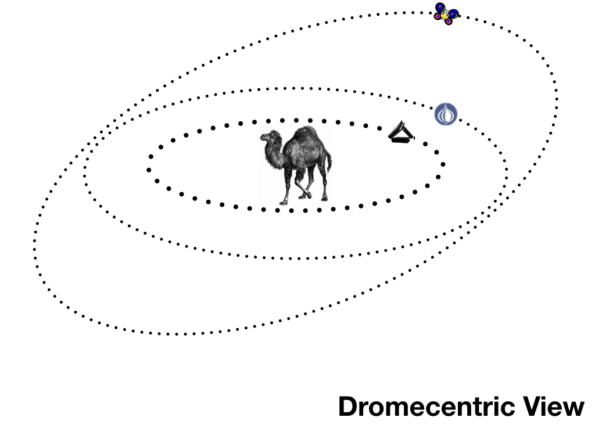

Migrating Perl 5 code to Perl 6
===============================

If you are a programmer who is programming / has programmed in Perl 5,
and you are taking your first steps in converting Perl 5 code to Perl 6,
you may encounter some issues.  Or if you are simply interested in knowing
about what one might encounter when trying to port Perl 5 programs to Perl 6.
In either case, this article is for you!

The [Perl 6 documentation](https://docs.perl6.org/) already contains most, if
not all
[documentation that you need](https://docs.perl6.org/language/5to6-overview)
to deal with all of the issues you will be confronted with in the quest of
migrating Perl 5 code to Perl 6.  But as documentation goes, the focus is
only on the factual differences.  I will try to go a little more in-depth
about specific issues, give a little bit more of a hands-on experience.
Experience that I've gained while doing quite a bit of porting Perl 5 code
to Perl 6 code myself.

How is Perl 6 anyway?
---------------------
Very well, thank you!  Since its first official release in December 2015,
Rakudo Perl 6 has seen an order of magnitude speed improvement, and quite
a few bug fixes (more than 14000 commits in total).  Seven books about
Perl 6 have been published since then so far.
"[Learning Perl 6](https://www.learningperl6.com)" by brian d foy is about
to be published by O'Reilly, re-worked from the seminal
"[Learning Perl](http://shop.oreilly.com/product/0636920049517.do)" (aka the
"Llama Book") which so many people have come to know and love.

The user distribution "[Rakudo Star](https://rakudo.org/files)" is on a
three-monthly release cycle, and more than 1100 modules are now available in
the [Perl 6 ecosystem](https://modules.perl6.org).  The Rakudo Compiler
Release is on a monthly release cycle and typically contains contributions
by more than 30 people.  Perl 6 modules are now uploaded to the
[PAUSE](https://pause.perl.org/pause/query?ACTION=pause_04about) and
distributed all over the world using the [CPAN](https://www.cpan.org).

The online [Introduction to Perl 6](https://perl6intro.com) has been
translated to 12 languages, allowing over 3 billion people to get an
introduction to Perl 6 in their native language.  The
[Perl 6 Weekly](https://p6weekly.wordpress.com) reports on all things Perl 6
every week, and has been doing so in this form for the past 4.5 years.

[Cro](https://cro.services), a micro-services framework uses all of the
features of Perl 6 from the ground up, providing HTTP 1.1 persistent
connections, HTTP 2.0 with request multiplexing and HTTPS with optional
certificate authority out of the box.  And a [Perl 6 IDE](https://commaide.com)
is now in (paid) BETA (think of this as a KickStarter with immediate
deliverables).

Using Perl 5 features in Perl 6
-------------------------------
Perl 5 code can be seamlessly integrated with Perl 6 using the
[`Inline::Perl5`](http://modules.perl6.org/dist/Inline::Perl5:cpan:NINE)
module, making *all of CPAN* available to any Perl 6 program.  One could
consider this cheating, as it will embed a Perl 5 interpreter, and therefore
continues to have a dependency on the `perl` (5) runtime.  But it *does*
make it as easy as adding "`:from<Perl5>`" to your `use` statement,
like "`use DBI:from<Perl5>;`" to get your Perl 6 code running if you need
access to modules that have not yet been ported.

In January 2018, I proposed a
[CPAN Butterfly Plan](https://www.perl.com/article/an-open-letter-to-the-perl-community/)
to convert Perl 5 functionality to Perl 6 as closely as possible to the
original API.  I stated this as a goal, because Perl 5 as a programming
language, is so much more than syntax alone.  Ask anyone what the unique
selling point of Perl is, and they will most likely tell you that that is
CPAN.  Therefore I think it's time to move from this view of the Perl universe:

to a more modern view:

In other words: put CPAN, as the most important element of Perl, in the
center.

Converting Semantics
--------------------
Furthermore, to be able to run Perl 5 code natively in Perl 6, one needs a
lot of Perl 5 semantics as well.  And having (optional) support for Perl 5
semantics available in Perl 6, lowers the conceptual threshold that Perl 5
programmers perceive when trying to program in Perl 6.  It's easier to feel
at home!

Since the publication of the CPAN Butterfly Plan, over 100 Perl 5 built-in
functions are now supported in Perl 6 with the same API.  Many functions
already exist in Perl 6, but have slightly different semantics, e.g. `shift`
in Perl 5 magically shifts from `@_` (or `@ARGV`) if no parameter is specified:
in Perl 6 the parameter is obligatory.

More than 50 Perl 5 CPAN distributions have also been ported to Perl 6 while
adhering to the original Perl 5 API.  These include core modules such as
[`Scalar::Util`](https://modules.perl6.org/dist/Scalar::Util) and
[`List::Util`](https://modules.perl6.org/dist/List::Util), but also non-core
modules such as [`Text::CSV`](https://modules.perl6.org/dist/Text::CSV) and
[`Memoize`](https://modules.perl6.org/dist/Memoize).  Distributions that are
upstream on the [River of CPAN](http://neilb.org/2015/04/20/river-of-cpan.html)
are targeted to have as much effect on the ecosystem as possible.

Summary
-------
Rakudo Perl 6 has matured in such a way that using Perl 6 is now a viable
approach to creating new interactive projects.  Being able to use reliable
and proven Perl 5 language components aids in lowering the threshold for
developers to use Perl 6.  And it builds towards a situation where the sum
of Perl 5 and Perl 6 becomes greater than its parts.
